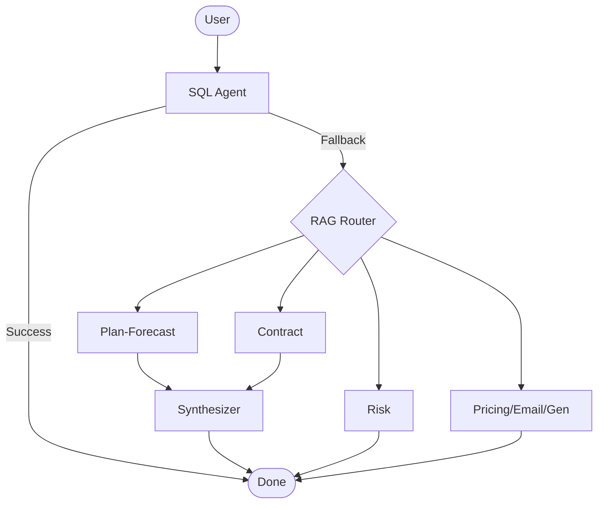

For professional services firm the following challenges are addressed:
Inaccurate Revenue Realization

Inefficient Status Updates 

Lack of Operational Governance 

Limited Predictive Foresight

Fragmented Visibility Across Geographies

Transparency and availability of information that would be understood by any stakeholder.

=======================================================

Key Features & Capabilities
✅ Revenue and Budget Governance
Automates billing milestone tracking, improved revenue assurance and reduces revenue leakage up to 4–5% of topline revenue.

Detects billing errors, missed charges, backlog conversions and non-compliant rates

Budgets, Forecast, Actual governance for enterprises.
✅ Customizable value stream framework for delivery management

Customize and operationalize global standard frameworks.

✅ Operational Efficiency
AI SmartAgents automate repetitive tasks (e.g., status tracking, timesheet validation, SOW validity, DAIR tracking, invoice )

Saves 25% of repetitive works of project managers, program managers and other supporting BusOps staff by Agentic automation.

=========================================================

# 📊 OpenClaw Project Presentation (Extended)

This document contains the 7-slide technical presentation for the OpenClaw Multi-Agent Project.

---

## 🛠️ Slide 1: Technology Stack
**The Core Engine**
- **Framework**: **OpenClaw Multi-Agent Framework** 🧩
- **Orchestration**: LangGraph & LangChain (Python)
- **API Framework**: FastAPI / Uvicorn
- **LLM Provider**: Groq (Llama-3-70B / Mixtral-8x7B)
- **Agent Protocol**: ACP (Agent Communication Protocol) v1

**Data & Analytics**
- **Structured**: SQLite (Project & RAID Database)
- **Unstructured**: ChromaDB (Vector Store for RAG)
- **Embeddings**: HuggingFace (`all-mpnet-base-v2`)

**Frontend & Logic**
- **UI**: Vanilla HTML5 / Modern CSS / JavaScript

---

## 🛰️ Slide 2: Solution Architecture
**High-Level Workflow**
1. **User Intersection**: Chat Interface + Data Manager (Semantic Search Refinement).
2. **Orchestration Layer**: LangGraph routes queries through a multi-agent mesh.
3. **Specialist Agents**: Dedicated nodes for Plan/Forecast, Risk, Contract, Pricing, and Email.
4. **Synthesis**: A centralized `Synthesizer` merges distributed logic into a single cohesive response.

---

## 🏗️ Slide 3: System Architecture
**The Hybrid Logic Pipeline**
- **Text-to-SQL Branch**: Direct mapping of natural language to SQLite schemas for structured metrics.
- **RAG Branch**: Semantic search fallback into ChromaDB for unstructured contract text.
- **ACP Communication**: Standardized REST wire format for agent-to-agent (A2A) collaboration.

**Data Pipeline**
- `unstructured` AI library for parsing `.docx` and `.xlsx` project files.
- Metadata-filtered RAG ensure context-relevant retrieval (Project ID / SOW ID).

---

## 🧬 Slide 4: High-Precision RAG (Special Process)
**Two-Pass Extraction Strategy**
To handle long contracts (50+ pages) without losing detail:

1. **Pass 1: Discovery Phase**: An LLM scans vector chunks specifically to identify unique entity keys (e.g., "Work Package #1" through "Work Package #11").
2. **Pass 2: Targeted Extraction**: For each discovered key, the system fetches hyper-focused context to perform deep extraction of milestones and dates.

**Benefit**: Eliminates "hallucination by omission" common in single-pass RAG systems.

---

## 🔋 Slide 5: LLM Token & Context Management
**History Sanity Anchors**
Maintaining precision in long conversations without "context drift":

- **The Anchor**: Every user query is prepended with a "Fact Check" system message containing live data from the DB (Active Project IDs).
- **History Pruning**: Conversation history is capped at 20 turns to maintain low latency on Groq.
- **Protocol isolation**: Specialists receive only relevant context via ACP, rather than the entire chat history.

---

## 🧠 Slide 6: Technical Decisions Summary
**Advanced Optimization**
- **Semantic Mapping**: `SemanticMap` bridge maps user-friendly terms to exact database attributes.
- **Reinforcement (RL)**: `QueryFeedback` logic scores and caches successful SQL patterns to accelerate future inference.
- **Negative Constraints**: "Rule 10" optimization prevents the parsing of Project IDs as years.

**Intelligence Features**
- **Context Inheritance**: Agents automatically pull identifiers from previous turns.
- **Dynamic Routing**: Real-time evaluation of query intent to choose the optimal processing pathway.

---

## 🛰️ Slide 7: Orchestration Flow
The multi-agent graph logic powered by LangGraph:

