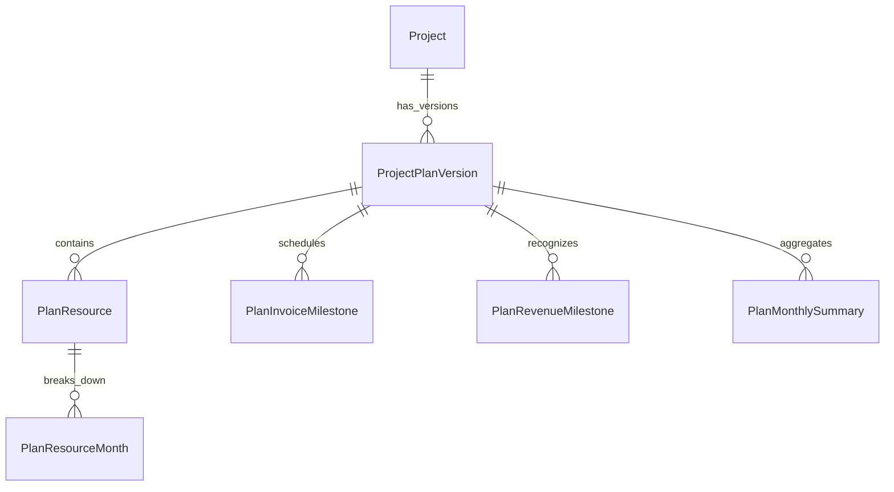

# Database Documentation: ProjectAgentEnterprise

This document outlines the SQLite database structure used in **ProjectAgentEnterprise**. The database is located at `./data/openclaw.db` by default.

## Database Configurations and Concurrency

To ensure stability, concurrent data access, and metadata integrity, the database engine enforces the following parameters on every active connection:
* **WAL Mode (Write-Ahead Logging)**: Enforced via `PRAGMA journal_mode=WAL` to allow multiple concurrent readers and a writer.
* **Foreign Key Constraints**: Enforced via `PRAGMA foreign_keys=ON` to maintain strict referential integrity.
* **Cascading Deletions**: Declared using `ON DELETE CASCADE` on all child tables to prevent orphaned records when projects or plan versions are deleted.

---

## 1. Core Project & Operational Tables

These tables represent the baseline entities imported from the documents or legacy structures.

### 1.1 `Project`
The core table containing project metadata, configuration details, and legacy JSON blobs.

| Column | Type | Description |
| :--- | :--- | :--- |
| `project_id` | TEXT (PK) | Unique project identifier (UUID). |
| `ProjectNumber` | TEXT | Unique internal project number/code (e.g. `202021`). |
| `OpportunityID` | TEXT | Linked CRM opportunity identifier. |
| `customer` | VARCHAR(200) | Customer company name. |
| `end_customer` | VARCHAR(200) | End customer company name. |
| `PMName` | VARCHAR(200) | Project Manager name. |
| `DMName` | VARCHAR(200) | Delivery Manager name. |
| `country` | VARCHAR(200) | Country of delivery. |
| `startdateContract` | DATETIME | Contract start date. |
| `endDateContract` | DATETIME | Contract end date. |
| `startdateBaseline` | DATETIME | Baseline start date. |
| `endDateBaseline` | DATETIME | Baseline end date. |
| `exchangerate` | VARCHAR(10) | Local exchange rate config. |
| `MBRReporting_currency` | VARCHAR(10) | Currency used for Monthly Business Review reporting. |
| `Proj_Stage` | VARCHAR(100) | Current project execution stage. |
| `Prod_Grp` | VARCHAR(100) | Product Group classification. |
| `Portfolio` | VARCHAR(100) | Portfolio vertical. |
| `Contr_Type` | VARCHAR(100) | Contract pricing type (T&M, Fixed Price). |
| `Rev_Type` | VARCHAR(100) | Revenue recognition model. |
| `Region` | VARCHAR(100) | Geographic region (e.g., EMEA). |
| `CMT` | VARCHAR(100) | Customer Market Team. |
| `Country_Group` | VARCHAR(100) | Country group. |
| `Project_Owner` | VARCHAR(200) | Project owner name. |
| `Delivery_Manager` | VARCHAR(200) | Delivery manager name. |
| `Q2C_Ops` | VARCHAR(200) | Quote-to-Cash operations contact. |
| `Start_Dt` | DATETIME | Project operational start date. |
| `End_Date` | DATETIME | Project operational end date. |
| `ActiveCurrency` | VARCHAR(10) | Currency code (e.g., USD, EUR). |
| `Baseline_Rev` | INTEGER | Baseline revenue total. |
| `Baseline_Cost` | INTEGER | Baseline cost total. |
| `SEGM_percent` | FLOAT | Sales Estimated Gross Margin percentage. |
| `DEGM_percent` | FLOAT | Delivery Estimated Gross Margin percentage. |
| `EGM_variance_percent` | FLOAT | Estimated Gross Margin variance percentage. |
| `sow_json` | TEXT | Statement of Work details (JSON string). |
| `resources_json` | TEXT | Legacy resource profile allocation data (JSON string). |
| `invoice_json` | TEXT | Legacy billing/invoice milestone schedule (JSON string). |
| `revenue_json` | TEXT | Legacy revenue recognition schedule (JSON string). |
| `total_hours_json` | TEXT | Legacy total hours profile (JSON string). |
| `total_project_cost` | FLOAT | Calculated total project baseline cost. |
| `travel_cost` | FLOAT | Planned project travel costs. |
| `other_cost` | FLOAT | Planned other costs. |
| `current_plan_version_id` | TEXT | Reference to current active `ProjectPlanVersion.plan_version_id`. |
| `current_approved_plan_version_id` | TEXT | Reference to current approved `ProjectPlanVersion.plan_version_id`. |

### 1.2 `ProjectWorkPackage`
Contains details of specific project phases/work packages extracted from SOW documents.
* **Foreign Key**: `project_id` REFERENCES `Project(project_id)` `ON DELETE CASCADE`.

| Column | Type | Description |
| :--- | :--- | :--- |
| `wp_id` | TEXT (PK) | Unique work package ID (UUID). |
| `project_id` | TEXT (FK) | Reference to the parent project. |
| `phase_name` | TEXT | Name of the phase/work package (e.g., *Phase 1 - Design*). |
| `phase_order` | INTEGER | Sequence order of the phase. |
| `prerequisites` | TEXT | Required prerequisites for the phase. |
| `activities` | TEXT | Detailed task activities list. |
| `customer_responsibilities` | TEXT | Responsibilities expected from the client. |
| `out_of_scope` | TEXT | Explicit out-of-scope boundaries. |
| `risks_mitigations` | TEXT | Phase-specific risks and mitigation plans. |
| `deliverables` | TEXT | Phase deliverables description. |
| `acceptance_criteria` | TEXT | Quality checks/criteria for acceptance. |
| `overview` | TEXT | High-level summary of the phase. |
| `engagement_summary` | TEXT | Narrative overview of the engagement. |
| `scope` | TEXT | Technical scope description. |
| `tech_landscape` | TEXT | Technology landscape. |
| `key_deliverables` | TEXT | Key deliverables. |
| `missing_items` | TEXT | Missing items. |
| `next_steps` | TEXT | Immediate action items. |
| `quick_summary` | TEXT | Concise visual summary. |

### 1.3 `ProjectWeeklySummary`
Tracks weekly health status updates, ITD numbers, and EAC/ETC values.
* **Foreign Key**: `project_id` REFERENCES `Project(project_id)` `ON DELETE CASCADE`.

| Column | Type | Description |
| :--- | :--- | :--- |
| `WeeklyID` | TEXT (PK) | Unique summary log ID. |
| `project_id` | TEXT (FK) | Reference to parent project. |
| `date` | DATETIME | Logging timestamp. |
| `Summary` | VARCHAR(4000)| Textual weekly status updates. |
| `overallStatus` | VARCHAR(25) | Project status color (Green/Amber/Red). |
| `CustomerSatisfaction` | VARCHAR(25) | Client satisfaction indicator. |
| `CustomerInteraction` | VARCHAR(25) | Customer engagement rating. |
| `DeliveryPerformance` | VARCHAR(25) | Delivery milestone health rating. |
| `LegalOrContract` | VARCHAR(25) | Legal risk status. |
| `FinancialPerformance` | VARCHAR(25) | Financial health rating. |
| `Resource` | VARCHAR(25) | Resource allocation health. |
| `Schedule` | VARCHAR(25) | Schedule/Timeline progress rating. |
| `ProductIssues` | VARCHAR(25) | Product/Technical issue count. |
| `ITD_Revenue` | INTEGER | Inception-To-Date actual revenue. |
| `ITD_Cost` | INTEGER | Inception-To-Date actual cost. |
| `Backlog_Rev` | INTEGER | Outstanding backlog revenue. |
| `ETC_Revenue` | INTEGER | Estimate-To-Complete revenue. |
| `ETC_Cost` | INTEGER | Estimate-To-Complete cost. |
| `EAC_Revenue` | INTEGER | Estimate-At-Completion revenue. |
| `EAC_Cost` | INTEGER | Estimate-At-Completion cost. |
| `plan_version_id` | TEXT | Reference to matching plan version. |
| `reporting_month` | DATE | Reporting month date. |

### 1.4 `RAIDitems`
Enterprise Risks, Assumptions, Issues, and Dependencies logs with financial & timeline metrics.
* **Foreign Key**: `project_id` REFERENCES `Project(project_id)` `ON DELETE CASCADE`.

| Column | Type | Description |
| :--- | :--- | :--- |
| `raidID` | TEXT (PK) | Unique identifier. |
| `project_id` | TEXT (FK) | Reference to parent project. |
| `LastupdateDate` | DATETIME | Last modified timestamp. |
| `Type` | VARCHAR(50) | Item type: `Risk`, `Assumption`, `Issue`, `Dependency`. |
| `Category` | VARCHAR(50) | Functional area (e.g., Technical, Resource). |
| `owner` | VARCHAR(100) | Item owner email or username. |
| `Description` | TEXT | Full description of the item. |
| `MitigatingAction` | TEXT | Action plan to mitigate risks or resolve issues. |
| `DueDate` | DATETIME | Target resolution date. |
| `ROAM` | VARCHAR(50) | ROAM categorization (Resolved, Owned, Accepted, Mitigated). |
| `StartDate` | DATETIME | Operational start date of tracking. |
| `EndDate` | DATETIME | Operational close date. |
| `Status` | VARCHAR(25) | State (`Open`, `Closed`). |
| `Statusdate` | DATETIME | Status change timestamp. |
| `Status_summary` | TEXT | Narrative status details. |
| `plan_version_id` | TEXT | Associated plan version ID. |
| `impact_area` | TEXT | Qualitative impact area (e.g., Financial, Resources). |
| `financial_impact` | REAL | Quantitative financial impact (currency). |
| `schedule_impact_days` | INTEGER | Quantitative timeline impact in days. |

### 1.5 `MBRitems`
Management Business Review milestones and monthly forecast entries.
* **Foreign Key**: `project_id` REFERENCES `Project(project_id)` `ON DELETE CASCADE`.

| Column | Type | Description |
| :--- | :--- | :--- |
| `mbr_id` | TEXT (PK) | Unique review log identifier. |
| `project_id` | TEXT (FK) | Reference to parent project. |
| `LastupdateDate` | DATETIME | Update timestamp. |
| `Baseline` | VARCHAR(25) | Comparison baseline version. |
| `Baseline_date` | DATETIME | Date baseline was established. |
| `ForecastDateMonth`| DATETIME | Target month for forecast. |
| `ForecastAmount` | FLOAT | Forecasted monthly cost/revenue. |
| `Status` | VARCHAR(25) | Status of forecast item. |
| `plan_version_id` | TEXT | Matching plan version ID. |

---

## 2. Versioned Relational Planning Schema

Introduced during the refactor to support version history, Excel uploads, and granular resource logs.

### 2.1 `ProjectPlanVersion`
Tracks distinct planning snapshots (baselines, manual edits, agent-proposed drafts).
* **Foreign Key**: `project_id` REFERENCES `Project(project_id)`.
* **Unique Index**: `idx_ppv_project_version` ON `(project_id, version_number)`.

| Column | Type | Description |
| :--- | :--- | :--- |
| `plan_version_id` | TEXT (PK) | Unique version identifier (UUID). |
| `project_id` | TEXT (FK) | Linked project ID. |
| `version_number` | INTEGER | Sequential version count (1, 2, 3...). |
| `version_name` | TEXT | Human-readable version tag (e.g., *Sales Baseline*). |
| `version_type` | TEXT | Enum: `SALES_BASELINE`, `PM_INITIAL`, `PM_REFORECAST`, `SYSTEM_REFORECAST`. |
| `source_type` | TEXT | Enum: `SYSTEM_JSON`, `EXCEL_UPLOAD`, `MANUAL`, `AGENT_DRAFT`. |
| `reporting_month` | DATE | Associated reporting cycle month. |
| `as_of_date` | DATE | System snapshot date. |
| `submitted_by` | TEXT | Username of submitter. |
| `submitted_at` | DATETIME | Submission timestamp. |
| `approved_by` | TEXT | Authorizing user. |
| `approved_at` | DATETIME | Approval timestamp. |
| `status` | TEXT | Enum: `Draft`, `Submitted`, `Approved`, `Rejected`, `Superseded`, `Locked`. |
| `supersedes_plan_version_id`| TEXT (FK) | Reference to previous version ID. |
| `is_current` | INTEGER | Active draft marker (`1` = True, `0` = False). |
| `is_baseline` | INTEGER | Main project baseline marker (`1` = True, `0` = False). |
| `comments` | TEXT | Version release notes. |
| `source_file_name` | TEXT | Uploaded Excel file name. |
| `created_at` | DATETIME | Created timestamp. |
| `updated_at` | DATETIME | Updated timestamp. |

### 2.2 `PlanResource`
Resource profiles defined in a plan version.
* **Foreign Key**: `plan_version_id` REFERENCES `ProjectPlanVersion(plan_version_id)` `ON DELETE CASCADE`.

| Column | Type | Description |
| :--- | :--- | :--- |
| `plan_resource_id` | TEXT (PK) | Unique resource planning record ID. |
| `plan_version_id` | TEXT (FK) | Associated plan version ID. |
| `role_name` | TEXT | Planned role (e.g., *Lead QA Engineer*). |
| `specialty` | TEXT | Technical skills/sub-domain. |
| `resource_name` | TEXT | Assigned personnel name (optional). |
| `notes` | TEXT | Performance notes. |
| `location` | TEXT | Geographic region of the resource. |
| `billable` | TEXT | Billable classification (Yes/No). |
| `effort_needs` | REAL | Baseline FTE value (e.g., `1.0`). |
| `list_price` | REAL | Standard hourly list rate. |
| `adjusted_rate` | REAL | Adjusted billable rate after discount. |
| `cost_per_hour` | REAL | Cost rate for the resource. |
| `total_hours` | REAL | Total planned hours across all months. |
| `total_fees` | REAL | Calculated total planned revenue fees. |
| `total_cost` | REAL | Calculated total planned cost. |

### 2.3 `PlanResourceMonth`
Month-by-month billing and cost breakdown for a plan resource.
* **Foreign Key**: `plan_resource_id` REFERENCES `PlanResource(plan_resource_id)` `ON DELETE CASCADE`.
* **Unique Index**: `idx_plan_resource_month_unique` ON `(plan_resource_id, month_date)`.

| Column | Type | Description |
| :--- | :--- | :--- |
| `plan_resource_month_id` | TEXT (PK) | Unique monthly allocation ID. |
| `plan_resource_id` | TEXT (FK) | Associated resource ID. |
| `month_date` | DATE | Specific target month. |
| `planned_hours` | REAL | Planned hours for this month. |
| `planned_revenue` | REAL | Planned revenue for this month. |
| `planned_cost` | REAL | Planned cost for this month. |

### 2.4 `PlanInvoiceMilestone`
Planned invoice and customer billing events.
* **Foreign Key**: `plan_version_id` REFERENCES `ProjectPlanVersion(plan_version_id)` `ON DELETE CASCADE`.

| Column | Type | Description |
| :--- | :--- | :--- |
| `plan_invoice_id` | TEXT (PK) | Milestone ID. |
| `plan_version_id` | TEXT (FK) | Associated plan version. |
| `detail` | TEXT | Detailed milestone narrative description. |
| `milestone_date` | DATE | Planned invoicing day. |
| `month_date` | DATE | Invoicing billing month. |
| `type` | TEXT | Classification. |
| `amount` | REAL | Invoice currency amount. |
| `currency` | TEXT | Billing currency (e.g., USD). |
| `status` | TEXT | Planned status (e.g., Planned, Invoiced). |

### 2.5 `PlanRevenueMilestone`
Revenue recognition rules and scheduled milestone dates.
* **Foreign Key**: `plan_version_id` REFERENCES `ProjectPlanVersion(plan_version_id)` `ON DELETE CASCADE`.

| Column | Type | Description |
| :--- | :--- | :--- |
| `plan_revenue_id` | TEXT (PK) | Milestone ID. |
| `plan_version_id` | TEXT (FK) | Associated plan version. |
| `detail` | TEXT | Milestone narrative description. |
| `revenue_date` | DATE | Targeted recognition date. |
| `month_date` | DATE | Recognition billing month. |
| `type` | TEXT | Classification. |
| `amount` | REAL | Milestone amount. |
| `currency` | TEXT | Milestone currency. |
| `recognition_rule` | TEXT | Rule engine name (e.g. *hours_plus_milestone*). |
| `status` | TEXT | Booking status. |

### 2.6 `PlanTravelCost`
Planned project travel and expense (T&E) budgets.
* **Foreign Key**: `plan_version_id` REFERENCES `ProjectPlanVersion(plan_version_id)` `ON DELETE CASCADE`.

| Column | Type | Description |
| :--- | :--- | :--- |
| `plan_travel_cost_id`| TEXT (PK) | Expense record ID. |
| `plan_version_id` | TEXT (FK) | Associated plan version. |
| `resource_name` | TEXT | Associated resource. |
| `notes` | TEXT | Location and travel descriptions. |
| `month_date` | DATE | Planned expense month. |
| `amount` | REAL | Expense amount. |
| `billable` | TEXT | Billable classification (Yes/No). |

### 2.7 `PlanOtherCost`
Planned auxiliary costs (hardware, licenses, subcontractors).
* **Foreign Key**: `plan_version_id` REFERENCES `ProjectPlanVersion(plan_version_id)` `ON DELETE CASCADE`.

| Column | Type | Description |
| :--- | :--- | :--- |
| `plan_other_cost_id` | TEXT (PK) | Cost record ID. |
| `plan_version_id` | TEXT (FK) | Associated plan version. |
| `cost_name` | TEXT | Item name. |
| `month_date` | DATE | Planned cost month. |
| `amount` | REAL | Cost amount. |
| `billable` | TEXT | Billable classification (Yes/No). |
| `total_fees` | REAL | Invoiced fees. |

### 2.8 `PlanMonthlySummary`
Denormalized database rollup summarizing monthly projections.
* **Foreign Key**: `plan_version_id` REFERENCES `ProjectPlanVersion(plan_version_id)` `ON DELETE CASCADE`.
* **Unique Index**: `idx_plan_monthly_summary_unique` ON `(plan_version_id, month_date)`.

| Column | Type | Description |
| :--- | :--- | :--- |
| `plan_monthly_summary_id` | TEXT (PK) | Unique monthly summary record. |
| `plan_version_id` | TEXT (FK) | Associated plan version. |
| `month_date` | DATE | Project operational month. |
| `total_hours` | REAL | Total hours rollup. |
| `total_resource_revenue` | REAL | Resource fee revenue rollup. |
| `total_resource_cost` | REAL | Resource cost rollup. |
| `total_invoice_amount` | REAL | Milestone billing rollup. |
| `total_revenue_amount` | REAL | Revenue recognized rollup. |
| `total_travel_cost` | REAL | Travel expense rollup. |
| `total_other_cost` | REAL | Other costs rollup. |
| `total_month_cost` | REAL | Total cost rollup. |

---

## 3. Financial Actuals & Metrics snapshots

Tracks recorded actuals and calculations generated by the analytics agents.

### 3.1 `ActualFinancialMonth`
Month-by-month financial actuals loaded from external ERP/invoicing databases.
* **Foreign Key**: `project_id` REFERENCES `Project(project_id)`.
* **Unique Index**: `idx_actual_financial_project_month` ON `(project_id, month_date)`.

| Column | Type | Description |
| :--- | :--- | :--- |
| `actual_financial_id` | TEXT (PK) | Unique actual record ID. |
| `project_id` | TEXT (FK) | Parent project ID. |
| `month_date` | DATE | Recording month. |
| `actual_hours` | REAL | Actual hours logged. |
| `actual_cost` | REAL | Actual cost incurred. |
| `actual_revenue` | REAL | Actual recognized revenue. |
| `actual_invoice` | REAL | Actual invoice amount issued. |
| `actual_travel_cost` | REAL | Actual travel cost logged. |
| `actual_other_cost` | REAL | Actual other cost logged. |
| `source` | TEXT | Extraction source (e.g. ERP, Excel). |
| `loaded_at` | DATETIME | Loaded timestamp. |

### 3.2 `ForecastMetricSnapshot`
Financial performance indicators calculated for a project and plan version.
* **Unique Index**: `idx_metric_snapshot_unique` ON `(project_id, plan_version_id, reporting_month)`.

| Column | Type | Description |
| :--- | :--- | :--- |
| `metric_snapshot_id` | TEXT (PK) | Unique snapshot ID. |
| `project_id` | TEXT (FK) | Parent project. |
| `plan_version_id` | TEXT (FK) | Target plan version. |
| `reporting_month` | DATE | Calculation reporting cycle. |
| `itd_revenue` | REAL | ITD (Inception-To-Date) revenue. |
| `itd_cost` | REAL | ITD (Inception-To-Date) cost. |
| `backlog_revenue` | REAL | Total remaining backlog. |
| `etc_revenue` | REAL | ETC (Estimate-To-Complete) revenue. |
| `etc_cost` | REAL | ETC (Estimate-To-Complete) cost. |
| `eac_revenue` | REAL | EAC (Estimate-At-Completion) revenue. |
| `eac_cost` | REAL | EAC (Estimate-At-Completion) cost. |
| `gm_amount` | REAL | Gross Margin amount. |
| `gm_percent` | REAL | Gross Margin percentage. |
| `calculated_at` | DATETIME | Calculation timestamp. |

### 3.3 `RevenueRecognitionTrace`
Audit calculations explaining how the system recognized revenue.

| Column | Type | Description |
| :--- | :--- | :--- |
| `revenue_trace_id` | TEXT (PK) | Trace record ID. |
| `project_id` | TEXT (FK) | Linked project ID. |
| `plan_version_id` | TEXT (FK) | Plan version ID. |
| `month_date` | DATE | Processed month. |
| `actual_hours` | REAL | Hours used in calculation. |
| `milestone_met` | INTEGER | Milestone criteria flag (`1` = Met). |
| `recognized_revenue` | REAL | Final calculated revenue. |
| `source_detail` | TEXT | Equation or raw inputs. |
| `calculated_at` | DATETIME | Calculation timestamp. |

---

## 4. SQL Inference & Agent Governance Tables

Supports dynamic queries and human-in-the-loop validation of actions.

### 4.1 `SqlQueryMemory`
Feedback loop glossary mapping natural language terms to clean SQL queries.
* **Index**: `idx_sql_memory_intent` ON `(intent_name, confidence_score)`.

| Column | Type | Description |
| :--- | :--- | :--- |
| `sql_memory_id` | TEXT (PK) | Record ID. |
| `intent_name` | TEXT | Identified intent class (e.g. `get_project_cost`). |
| `user_query_pattern` | TEXT | Common user sentence pattern. |
| `normalized_query` | TEXT | Cleaned lookup query. |
| `sql_template` | TEXT | Parametrized SQL statement. |
| `required_parameters` | TEXT | Expected JSON parameters. |
| `schema_entities` | TEXT | Table/column dependencies. |
| `route_hint` | TEXT | Suggested agent route. |
| `success_count` | INTEGER | Execution successes. |
| `failure_count` | INTEGER | Execution errors. |
| `confidence_score` | REAL | Accuracy weight (`0.0` - `1.0`). |
| `last_used_at` | DATETIME | Last use timestamp. |

### 4.2 `AgentActionLog`
Audits autonomous actions proposed or executed by agents.

| Column | Type | Description |
| :--- | :--- | :--- |
| `agent_action_id` | TEXT (PK) | Action audit record ID. |
| `project_id` | TEXT | Associated project. |
| `plan_version_id` | TEXT | Associated version. |
| `agent_id` | TEXT | Identifies the originating agent. |
| `action_type` | TEXT | Action (e.g. `UPDATE_FORECAST`). |
| `input_payload` | TEXT | Input parameters (JSON string). |
| `output_payload` | TEXT | Output results (JSON string). |
| `status` | TEXT | Status (e.g. Pending, Executed). |
| `requires_human_approval` | INTEGER | Safety gate flag (`1` = Requires Approval). |
| `created_at` | DATETIME | Created timestamp. |

### 4.3 `HumanApprovalQueue`
Authorization gates preventing agents from committing financial or governance edits automatically.
* **Index**: `idx_human_approval_project_status` ON `(project_id, status)`.

| Column | Type | Description |
| :--- | :--- | :--- |
| `approval_id` | TEXT (PK) | Queue entry ID (UUID). |
| `project_id` | TEXT | Target project ID. |
| `plan_version_id` | TEXT | Target plan version ID. |
| `agent_action_id` | TEXT (FK) | Reference to the log record. |
| `approval_type` | TEXT | Classification (e.g., `FORECAST_APPROVAL`). |
| `title` | TEXT | Human-readable title. |
| `proposed_payload` | TEXT | Proposed SQL/data payload (JSON string). |
| `status` | TEXT | Queue state (`Pending`, `Approved`, `Rejected`). |
| `requested_by_agent` | TEXT | Originating agent name. |
| `approved_by` | TEXT | Authorizing user username. |
| `approved_at` | DATETIME | Action timestamp. |
| `rejection_reason` | TEXT | Reason for rejection. |
| `created_at` | DATETIME | Created timestamp. |
