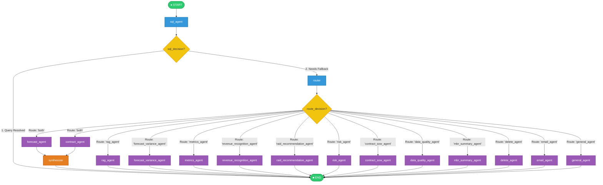
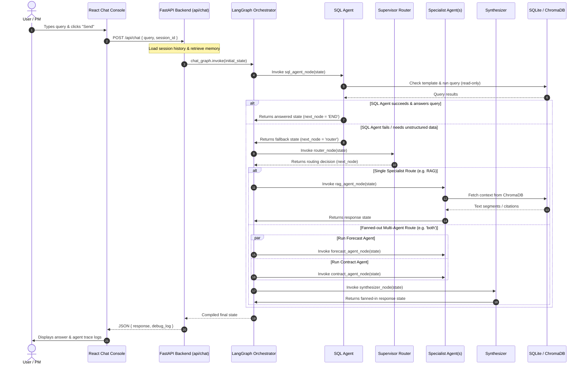
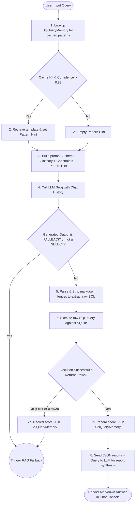

# Detailed Design & Architecture: ProjectAgentEnterprise

This document provides a comprehensive view of the architectural design, agent routing workflows, document extraction systems, and operational governance rules in **ProjectAgentEnterprise**.

---

## 1. Evolution from OpenClaw

The system transitioned from a command-line/notebook prototype using the legacy **OpenClaw** framework into an enterprise-ready web application:

| Architectural Component | Legacy OpenClaw Prototype | Refactored Enterprise Architecture |
| :--- | :--- | :--- |
| **Frontend** | Vanilla HTML / CSS / JS with socket wrappers | **React.js** with TypeScript, Tailwind CSS, and Vite |
| **Backend Gateway** | Node.js gateway (running port 3000) | **FastAPI** REST API on port 8000 |
| **Orchestration** | Python FastAPI with in-memory dicts | **LangGraph StateGraph** with file-backed session memory |
| **Agent Registry** | Custom A2A card declarations | Centralized **YAML configuration files** |
| **Database** | Normalized SQLite tables only | Relational version-controlled planning schema |
| **Document Search** | Single-pass vector similarity (k=30 limit) | **Map-Reduce Discovery + Targeted Retrieval** |
| **Governance** | Direct edits or basic console outputs | **Human-in-the-Loop approval queue** with audit logs |

---

## 2. Multi-Agent Orchestration (LangGraph)

The core logic of the chat console runs on **LangGraph**. The system leverages a **Supervisor-Agent** pattern.

### 2.1 The Complete StateGraph Flow
The compiled StateGraph workflow maps any user query from the entry node through the routing gates to the correct specialist agents, supporting concurrent execution ("fanning out") and synthesis:



### 2.2 Lifecycle Sequence of a User Query
This diagram tracks a query from the frontend, through API validation and LangGraph execution, down to the database layers:



### 2.3 Hybrid Intent Routing
The Supervisor Router routes queries using a three-layer priority system:
1. **Deterministic Rule Matching**: Identifies core keywords to map queries immediately to specific agents (e.g. `"etc"`, `"eac"`, or `"gm"` bypass LLM classification and route directly to the SQL agent).
2. **SQL Glossary Memory Lookup**: Matches query patterns against `SqlQueryMemory` to check if a high-confidence query pattern exists.
3. **LLM Classification Fallback**: Invokes the LLM to classify ambiguous queries into one of the specialist agent identifiers (or `"both"`/`"general"`).

---

## 3. SQL Translation & Dynamic Generation Layer

The **SQL Inference Agent** utilizes a Text-to-SQL dynamic pipeline to translate natural language user questions into read-only SQL statements. The process uses query caching, glossary mapping, strict safety rules, and validation scoring.

### 3.1 Text-to-SQL Process Flow Diagram



### 3.2 SQL Generation and Execution Details

#### A. Session Memory & Glossary Loading
The agent retrieves context data (e.g. current project, active forecast cycle) from the `AgentState` short-term memory keys (`project_id`, `reporting_month`). Simultaneously, it queries the `SemanticMap` glossary table to load user-customized keyword mappings, such as mapping the term `"overdue"` to the specific SQL filter `"DueDate < date('now')"`.

#### B. Prompt Formulation & Safety Constraints
A detailed prompt is sent to the LLM containing the schema definitions, glossary keywords, and strict negative constraints:
* **No Deprecated Columns**: The prompt explicitly forbids the use of columns that are no longer part of the relational schema (such as `subtotal`, `Priority`, and `currency`).
* **Prevent Fan-out Aggregations**: Instructs the LLM not to join the main `Project` table to multiple one-to-many tables (like joining both `ProjectWorkPackage` and `RAIDitems` in a single query) because doing so corrupts mathematical summaries (`SUM`, `COUNT`).
* **String Comparison Safeguard**: Enforces `LIKE '%term%'` instead of `=` for text fields to accommodate formatting variance.
* **No Date Conversions for IDs**: Prevents the LLM from trying to convert project numbers (e.g., `202021`) into year filters.

#### C. Verification, Scoring, and Feedback Loop
When the LLM outputs a SQL query, it is executed inside a validation wrapper:
* **Success Gate**: If the query executes successfully and returns rows, the pattern is cached or incremented in `SqlQueryMemory` via `record_result(query, generated_sql, 1)`.
* **Failure Gate**: If the query generates an SQLite syntax error, contains forbidden commands (non-SELECT writes), or returns `0` records, it is logged and down-scored via `record_result(query, generated_sql, -1)`. The system then updates the state to fallback to the `router` node to invoke unstructured document search (RAG).

#### D. Synthesis
The returned query dataset is serialized into a JSON array and sent to the LLM. The LLM acts as a financial analyst, converting the raw data tables into a concise, professional markdown response.

---

## 4. SOW Extraction Strategy (Map-Reduce + Targeted Retrieval)

The previous system suffered from silent extraction failures. When processing a 100+ page SOW contract using basic vector similarity retrieval (e.g. `k=30`), similar chunks pushed crucial work package milestones out of the LLM context window.

To guarantee 100% extraction coverage, the system uses a **Map-Reduce Discovery** and **Targeted Retrieval** pipeline:

```text
SOW Document
   ↓
Pass 1: Map-Reduce Discovery
  ├── 1. Read all document nodes from ChromaDB
  ├── 2. Pre-filter nodes matching terms: "work package", "phase", "appendix"
  ├── 3. Send chunks to LLM: "Identify any work package phase names and numbers"
  └── 4. Reduce: Deduplicate, sort sequentially, and construct WorkPackage list
   ↓
Pass 2: Targeted Detail Retrieval
  ├── For each discovered Work Package (e.g. WP 5):
  │     ├── Run vector query: "WP 5 scope deliverables activities milestones"
  │     └── Send top 10 relevant nodes + WP details to LLM for full extraction
  └── Validate output strictly using Pydantic JSON schemas
   ↓
Save to ProjectWorkPackage Table (ON DELETE CASCADE active)
```

This guarantees that:
* **Context Contamination is Eliminated**: Chunks from other phases are excluded during details extraction.
* **Strict Validation**: Langchain's `PydanticOutputParser` verifies that all 15 required fields are returned in JSON.

---

## 5. Human-in-the-Loop Governance Model

To prevent autonomous agents from accidentally editing project budgets, financial actuals, or contracts, the system enforces a strict **Level 3-4 Autonomy Model**:

* **What Agents Can Do Independently**:
  * Analyze trends and calculate budget variance (ETC/EAC).
  * Flag project risks and recommend new RAID items.
  * Audit data quality (empty fields, layout schema mismatches).
  * Generate draft Monthly Business Review (MBR) reports.
* **What Agents CANNOT Do Independently (Approval Required)**:
  * Overwrite financial actual records.
  * Formally approve forecast plan versions.
  * Add live RAID items to the active ledger.
  * Dispatch emails or release reports to stakeholders.

### 5.1 Approval Workflow
1. When an agent determines a change is necessary, it creates a record in `AgentActionLog` with `requires_human_approval = 1`.
2. It pushes the action payload to the `HumanApprovalQueue` in a `Pending` state.
3. The React Frontend alerts the user in the **Approval Queue** dashboard.
4. If approved, the service executes the proposed action and updates status to `Approved`. If rejected, it records the rejection comments and status remains `Rejected`.
