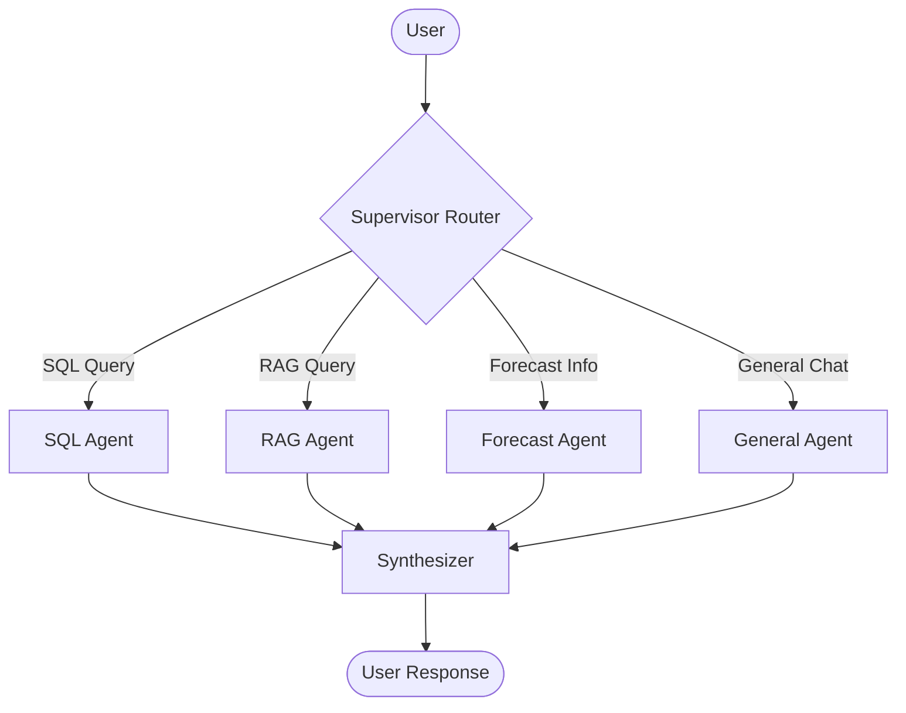

# 📊 ProjectAgentEnterprise Slide Presentation

This document contains the 7-slide technical presentation for the ProjectAgentEnterprise project.

---

## 🛠️ Slide 1: Technology Stack
**The Core Engine**
* **Framework**: **LangGraph Orchestrator** 🧩
* **Orchestration**: LangGraph, LangChain, and Pydantic (Python)
* **API Framework**: FastAPI / Uvicorn (REST API)
* **LLM Provider**: Groq Cloud (Llama-3-70B / Mixtral-8x7B)

**Data & Analytics**
* **Structured**: SQLite with WAL (Write-Ahead Logging) and Foreign Keys active
* **Unstructured**: ChromaDB (Vector Store for RAG)
* **Embeddings**: HuggingFace (`all-mpnet-base-v2`)

**Frontend & Logic**
* **UI**: React.js with TypeScript, Tailwind CSS, Lucide icons, and Vite

---

## 🛰️ Slide 2: Solution Architecture
**High-Level Workflow**
1. **User Intersection**: React Chat Interface + Project Dashboard + Data Manager (Semantic Glossary).
2. **Orchestration Layer**: LangGraph Supervisor routes queries through a specialist agent mesh.
3. **Specialist Agents**: Dedicated nodes for Plan/Forecast, SOW/Contracts, RAID/Risks, Financial Metrics, and Summarization.
4. **Synthesis**: A centralized `Synthesizer` node merges responses into clean, formatted markdown.

---

## 🏗️ Slide 3: System Architecture
**The Hybrid Logic Pipeline**
* **Text-to-SQL Branch**: Direct mapping of natural language to SQLite schemas for structured metrics.
* **RAG Branch**: Semantic search fallback into ChromaDB for unstructured contract text.
* **API Integration**: REST-based communication between React frontend and FastAPI backend.

**Data Pipeline**
* LlamaIndex document reader for parsing `.docx` and `.xlsx` project files.
* Metadata-filtered RAG to ensure context-relevant retrieval (Project ID / SOW ID).

---

## 🧬 Slide 4: High-Precision RAG
**Two-Pass Extraction Strategy**
To handle long contracts (50+ pages) without losing detail:

1. **Pass 1: Map-Reduce Discovery**: An LLM scans vector chunks specifically to identify unique entity keys (e.g., "Work Package #1" through "Work Package #11").
2. **Pass 2: Targeted Extraction**: For each discovered key, the system fetches hyper-focused context to perform deep extraction of milestones and dates.

**Benefit**: Eliminates "hallucination by omission" common in single-pass RAG systems.

---

## 🔋 Slide 5: LLM Token & Context Management
**History Sanity Anchors**
Maintaining precision in long conversations without "context drift":

* **The Anchor**: Every user query is prepended with a "Fact Check" system message containing live data from the DB (Active Project IDs).
* **History Pruning**: Conversation history is capped at 20 turns to maintain low latency on Groq.
* **Agent isolation**: Specialist agents receive only relevant context rather than the entire chat history.

---

## 🧠 Slide 6: Technical Decisions Summary
**Advanced Optimization**
* **Semantic Mapping**: `SemanticMap` bridge maps user-friendly terms to exact database attributes.
* **Reinforcement (RL)**: `QueryFeedback` logic scores and caches successful SQL patterns to accelerate future inference.
* **Negative Constraints**: Prevents parsing of Project IDs (e.g. `202021`) as years.

**Intelligence Features**
* **Context Inheritance**: Agents automatically pull identifiers from previous turns.
* **Dynamic Routing**: Real-time evaluation of query intent to choose the optimal processing pathway.

---

## 🛰️ Slide 7: Orchestration Flow
The multi-agent graph logic powered by LangGraph:

