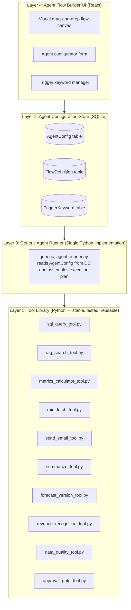
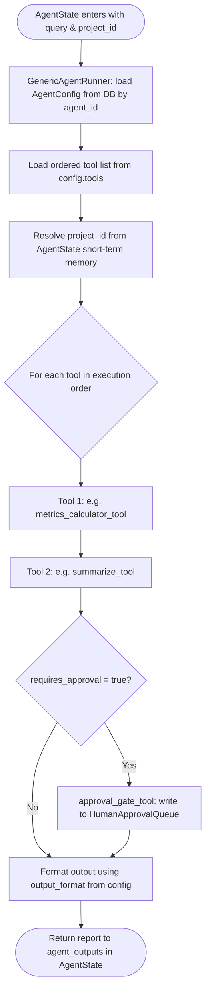
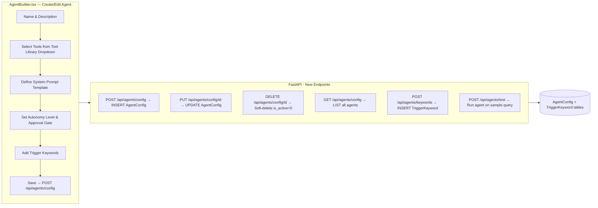
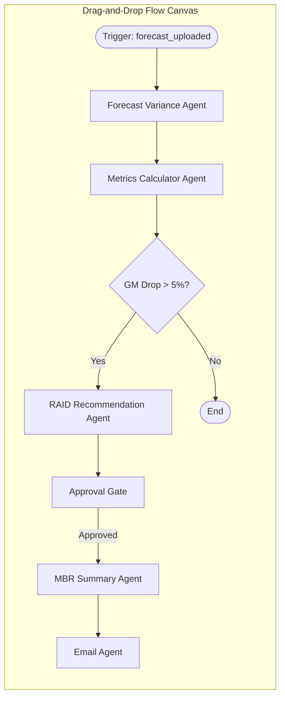

# TO-BE Architecture: Configurable Agent Platform
## ProjectAgentEnterprise — Evolution from Code-Driven to Configuration-Driven Agents

**Document Date:** May 2026
**Status:** Proposed Design — Phase 3 / Phase 4 Roadmap

---

## 1. The Problem: Agent Sprawl in the AS-IS Architecture

In the current AS-IS implementation, every agent in the system requires changes across **five separate code locations** before it can function:

| Step | File Changed | What Is Done |
| :--- | :--- | :--- |
| 1 | `backend/app/agents/<new_agent>.py` | Write a new Python class from scratch |
| 2 | `backend/app/graph/supervisor_graph.py` | Import the function and register it as a node |
| 3 | `backend/app/graph/router.py` | Add trigger keywords to `RULE_KEYWORDS` dictionary |
| 4 | `manifests/agent_registry.yaml` | Add a YAML agent card entry |
| 5 | Deploy & Restart | Stop the server, redeploy, restart |

### AS-IS Agent Count (Current State)
The following **18 Python files** currently exist in `backend/app/agents/`:

```text
backend/app/agents/
├── sql_agent.py               (11,057 bytes — highest complexity)
├── risk_agent.py              ( 7,893 bytes)
├── contract_agent.py          ( 3,362 bytes)
├── email_agent.py             ( 3,202 bytes)
├── forecast_agent.py          ( 3,392 bytes)
├── mbr_summary_agent.py       ( 2,798 bytes)
├── metrics_agent.py           ( 2,763 bytes)
├── rag_agent.py               ( 2,723 bytes)
├── data_quality_agent.py      ( 2,492 bytes)
├── revenue_recognition_agent.py (2,022 bytes)
├── forecast_variance_agent.py ( 2,192 bytes)
├── raid_recommendation_agent.py (1,787 bytes)
├── contract_sow_agent.py      ( 2,128 bytes)
├── delete_agent.py            ( 2,685 bytes)
├── general_agent.py           ( 1,102 bytes)
├── synthesizer.py             ( 1,568 bytes)
└── llm_factory.py             (   491 bytes)
```

### Structural Problems Identified
1. **Duplicated Boilerplate**: Every agent file contains the same 4-step pattern — extract identifier from query → call a service → call LLM for synthesis → return outputs to state. There is no shared abstraction over this pattern.
2. **Tight Coupling of Intent to Code**: Adding a new business requirement (e.g., a "Contract Expiry Alert Agent") requires a developer. A business analyst cannot define agents without touching Python.
3. **Brittle Routing**: `router.py` contains a hardcoded `RULE_KEYWORDS` dictionary. If a keyword is misspelled or a new term is not added, queries silently fall through to the LLM classifier or wrong agent.
4. **Restart Required**: Any change to any agent file or routing keyword requires a server restart, interrupting active sessions.
5. **No Reusability**: The same pattern of "fetch plan version → call LLM" appears separately in `forecast_variance_agent.py`, `metrics_agent.py`, and `mbr_summary_agent.py`. Each implements it independently.

---

## 2. TO-BE Architecture: Four-Layer Configurable Agent Platform

The proposed TO-BE architecture replaces individual agent Python files with a **four-layer platform** where agents are assembled from a library of reusable tools, configured via a database, and optionally wired together visually.



---

## 3. Layer 1: Tool Library — The Atomic Reusable Building Blocks

Instead of agent-specific Python files, the platform exposes a small, stable set of **atomic tool functions**. Each tool does exactly one thing, is thoroughly unit-tested, and is used across multiple agents.

### Tool Registry (TO-BE `backend/app/tools/`)

| Tool File | Function | What It Does | Replaces (AS-IS) |
| :--- | :--- | :--- | :--- |
| `sql_query_tool.py` | `run_sql_query(query, context)` | Generates and executes dynamic SQL against SQLite using schema + glossary + negative constraints | `sql_agent.py` core logic |
| `rag_search_tool.py` | `rag_search(query, project_id, k)` | Retrieves semantic chunks from ChromaDB for a project's documents | `rag_agent.py` core logic |
| `metrics_calculator_tool.py` | `calculate_metrics(project_id)` | Fetches `ForecastMetricSnapshot` and calculates ETC/EAC/GM values | `metrics_agent.py` → `metrics_service.py` |
| `forecast_version_tool.py` | `get_plan_versions(project_id)` | Fetches versioned forecast history from `ProjectPlanVersion` | `forecast_variance_agent.py` |
| `raid_fetch_tool.py` | `get_open_raids(project_id)` | Fetches open RAID items from `RAIDitems` | `raid_recommendation_agent.py` |
| `send_email_tool.py` | `send_email(to, subject, body)` | Sends email via Gmail API integration | `email_agent.py` |
| `summarize_tool.py` | `summarize_context(data, prompt)` | Calls the LLM to generate a narrative report from structured data | Used by all agents for synthesis |
| `revenue_recognition_tool.py` | `calculate_revenue(project_id, month)` | Applies recognition rules from `PlanRevenueMilestone` and `ActualFinancialMonth` | `revenue_recognition_agent.py` |
| `data_quality_tool.py` | `run_quality_checks(project_id)` | Executes quality rules (missing actuals, stale forecasts, orphaned versions) | `data_quality_agent.py` |
| `approval_gate_tool.py` | `create_approval_request(action_type, payload)` | Writes to `HumanApprovalQueue` and blocks autonomous execution | `approval_service.py` |

### Tool Design Pattern
Every tool follows the same contract — no state dependencies, pure function inputs and outputs:

```python
# TO-BE Tool contract example: backend/app/tools/metrics_calculator_tool.py

def calculate_metrics(project_id: str, reporting_month: str | None = None) -> dict:
    """
    Fetch and return the latest ForecastMetricSnapshot for a project.
    Returns: { itd_cost, itd_revenue, etc_cost, etc_revenue,
               eac_cost, eac_revenue, gm_amount, gm_percent }
    Raises: ValueError if no metrics found.
    """
    ...
```

---

## 4. Layer 2: Agent Configuration Store

Instead of individual Python files, all agents are **rows in the database**. A business analyst or power user can create a new agent entirely through the UI without writing a single line of code.

### New Database Tables (TO-BE Schema)

#### `AgentConfig` Table
Stores the complete definition of every agent in the system.

| Column | Type | Description |
| :--- | :--- | :--- |
| `agent_id` | TEXT (PK) | Unique agent identifier (e.g. `mbr_summary_agent`) |
| `name` | TEXT | Human-readable display name |
| `description` | TEXT | Purpose description shown in UI |
| `agent_type` | TEXT | Enum: `chat_responder`, `autonomous_workflow`, `approval_gated` |
| `system_prompt_template` | TEXT | LLM system prompt with `{context}` and `{query}` placeholders |
| `tools` | TEXT | JSON array of tool IDs to invoke (e.g. `["metrics_calculator_tool", "summarize_tool"]`) |
| `tool_execution_order` | TEXT | JSON array defining the sequence of tool calls |
| `autonomy_level` | INTEGER | 1–5 scale (Level 5 = fully autonomous, Level 1 = human only) |
| `requires_approval` | INTEGER | `1` = must write to `HumanApprovalQueue` before acting |
| `output_format` | TEXT | Enum: `markdown`, `json`, `table` |
| `is_active` | INTEGER | `1` = enabled, `0` = disabled (hot-toggle, no restart needed) |
| `created_by` | TEXT | Username of the creator |
| `created_at` | DATETIME | Creation timestamp |
| `updated_at` | DATETIME | Last modification timestamp |

#### `TriggerKeyword` Table
Stores the routing keywords for each agent, replacing the hardcoded `RULE_KEYWORDS` in `router.py`.

| Column | Type | Description |
| :--- | :--- | :--- |
| `keyword_id` | TEXT (PK) | Unique keyword record ID |
| `agent_id` | TEXT (FK) | Linked `AgentConfig.agent_id` |
| `keyword` | TEXT | Trigger phrase (e.g. `"monthly business review"`) |
| `match_type` | TEXT | Enum: `contains`, `starts_with`, `exact` |
| `priority` | INTEGER | Priority order (lower = checked first) |
| `is_active` | INTEGER | Hot-toggle per keyword without restart |

#### `FlowDefinition` Table
Stores user-designed multi-agent workflow graphs as JSON, supporting the visual flow builder.

| Column | Type | Description |
| :--- | :--- | :--- |
| `flow_id` | TEXT (PK) | Unique flow ID |
| `flow_name` | TEXT | Human-readable workflow name |
| `trigger_event` | TEXT | Enum: `forecast_uploaded`, `raid_created`, `scheduled`, `manual` |
| `flow_graph_json` | TEXT | JSON graph definition: nodes (agents), edges (connections), conditions |
| `is_active` | INTEGER | Enable/disable without restart |
| `created_by` | TEXT | Creator username |
| `created_at` | DATETIME | Creation timestamp |

---

## 5. Layer 3: Generic Agent Runner — The Single Python Implementation

This is the most critical architectural change. All 14 specialist Python agent files are **replaced by one file**: `generic_agent_runner.py`.

### How It Works



### Generic Agent Runner Implementation Sketch

```python
# TO-BE: backend/app/agents/generic_agent_runner.py

from app.tools import TOOL_REGISTRY  # dict of tool_id → callable
from app.db.engine import get_db
from app.graph.state import AgentState


class GenericAgentRunner:
    """
    Loads agent configuration from the AgentConfig table and dynamically
    assembles an execution plan from the registered tool library.
    No hardcoded agent logic — all behaviour is driven by configuration.
    """

    def __init__(self, agent_id: str):
        self.agent_id = agent_id
        self.config = self._load_config()

    def _load_config(self) -> dict:
        """Fetch agent configuration from the AgentConfig database table."""
        db = next(get_db())
        row = db.execute(
            "SELECT * FROM AgentConfig WHERE agent_id = ? AND is_active = 1",
            (self.agent_id,)
        ).fetchone()
        if not row:
            raise ValueError(f"Agent '{self.agent_id}' not found or inactive.")
        return dict(row)

    def run(self, state: AgentState) -> dict:
        """Execute the agent by running each configured tool in order."""
        query = state.get("query", "")
        project_id = state.get("project_id", "")
        context_data = {}

        tools = json.loads(self.config["tools"])
        for tool_id in tools:
            tool_fn = TOOL_REGISTRY.get(tool_id)
            if tool_fn:
                result = tool_fn(query=query, project_id=project_id, context=context_data)
                context_data[tool_id] = result

        # Final synthesis step
        report = summarize_tool(
            data=context_data,
            prompt=self.config["system_prompt_template"],
            query=query
        )

        if self.config["requires_approval"]:
            approval_gate_tool(
                action_type=self.agent_id,
                payload=context_data,
                project_id=project_id
            )

        return {
            "agent_outputs": state.get("agent_outputs", []) + [report],
            "debug_log": state.get("debug_log", "") + f"\n✅ {self.config['name']} completed."
        }


def make_agent_node(agent_id: str):
    """Factory function: creates a LangGraph-compatible node function for any agent_id."""
    def node(state: AgentState) -> dict:
        runner = GenericAgentRunner(agent_id)
        return runner.run(state)
    return node
```

### Dynamic Graph Construction
`supervisor_graph.py` is rewritten to load agent configurations from the database at startup and register all active agents dynamically:

```python
# TO-BE: backend/app/graph/supervisor_graph.py

def build_chat_graph():
    workflow = StateGraph(AgentState)

    # Always register the SQL Agent and Router (special nodes)
    workflow.add_node("sql_agent", sql_agent_node)
    workflow.add_node("router", dynamic_router_node)   # loads keywords from DB
    workflow.add_node("synthesizer", synthesizer_node)

    # Dynamically register all active agents from AgentConfig table
    active_agents = load_active_agents_from_db()  # SELECT agent_id FROM AgentConfig WHERE is_active=1
    for agent_id in active_agents:
        workflow.add_node(agent_id, make_agent_node(agent_id))
        workflow.add_edge(agent_id, END)

    # Routing edges remain the same structure
    workflow.set_entry_point("sql_agent")
    workflow.add_conditional_edges("sql_agent", _sql_decision, {...})
    workflow.add_conditional_edges("router", _dynamic_route_decision, ...)

    return workflow.compile()
```

### Dynamic Router
`router.py` is rewritten to load keywords from the `TriggerKeyword` table instead of the hardcoded `RULE_KEYWORDS` dictionary:

```python
# TO-BE: backend/app/graph/router.py

def _load_rule_keywords() -> dict[str, list[str]]:
    """Load routing keywords from TriggerKeyword table — live, no restart needed."""
    conn = sqlite3.connect(settings.db_abs_path)
    rows = conn.execute(
        "SELECT agent_id, keyword FROM TriggerKeyword WHERE is_active = 1 ORDER BY priority ASC"
    ).fetchall()
    conn.close()
    result = {}
    for agent_id, keyword in rows:
        result.setdefault(agent_id, []).append(keyword)
    return result

def _rule_route(query: str) -> str | None:
    keywords = _load_rule_keywords()  # Live DB load (cached with TTL in production)
    q = query.lower()
    for agent_id, kws in keywords.items():
        if any(kw in q for kw in kws):
            return agent_id
    return None
```

---

## 6. Layer 4: Agent Flow Builder UI (React)

The final layer exposes the entire agent configuration platform through the React frontend. A business analyst can build, test, and deploy agents without touching any Python code.

### New React Pages Required

```text
frontend-react/src/pages/
├── AgentBuilder.tsx          ← NEW: Form to create/edit an AgentConfig record
├── AgentFlowCanvas.tsx       ← NEW: Visual drag-and-drop flow builder
├── AgentLibrary.tsx          ← NEW: Browse all active agents and their tool makeup
├── TriggerKeywordManager.tsx ← NEW: Manage routing keywords per agent
├── ChatConsole.tsx           ← EXISTING (unchanged)
├── ApprovalQueue.tsx         ← EXISTING (unchanged)
└── Dashboard.tsx             ← EXISTING (unchanged)
```

### Agent Builder UI Flow



### Visual Flow Builder Concepts
The **AgentFlowCanvas.tsx** enables users to define autonomous multi-step workflows:



The canvas serializes the flow to a `FlowDefinition.flow_graph_json` record in the database. A **Universal Flow Executor** reads this JSON at runtime, dynamically builds the LangGraph conditional edges, and executes the workflow.

---

## 7. AS-IS vs TO-BE Comparison

| Concern | AS-IS | TO-BE |
| :--- | :--- | :--- |
| **Adding a new agent** | Create Python file, add 5 imports, restart server | Fill a form in AgentBuilder UI, click Save — live immediately |
| **Agent routing keywords** | Edit `RULE_KEYWORDS` dict in `router.py`, redeploy | Add/edit keywords in TriggerKeywordManager UI |
| **Number of agent Python files** | 18 files, 50,000+ bytes of duplicated boilerplate | 1 `generic_agent_runner.py` + 10 atomic tool files |
| **Disabling a broken agent** | Comment out import, remove graph node, restart | Toggle `is_active = 0` in UI — takes effect immediately |
| **Multi-step autonomous workflows** | Hardcoded sequences in supervisor_graph.py | JSON flow definitions built in visual canvas, stored in DB |
| **Business analyst involvement** | Zero (requires Python developer) | Full (BA creates and manages agents independently) |
| **Testing new agent before deploying** | Manually write test script | Use `/api/agents/test` endpoint from Agent Builder UI |

---

## 8. Migration Plan (AS-IS → TO-BE)

The migration is designed to be **incremental and non-breaking**. The existing agents continue to function while new agents are created via the platform.

| Phase | Work | Outcome |
| :--- | :--- | :--- |
| **Phase 3.1** | Create `AgentConfig`, `TriggerKeyword`, `FlowDefinition` tables in SQLite migrations | Database ready for configuration storage |
| **Phase 3.2** | Build the Tool Library (`backend/app/tools/`) by extracting logic from existing agent files | 10 atomic, tested, reusable tool functions |
| **Phase 3.3** | Build `generic_agent_runner.py` and `make_agent_node()` factory | Generic runner validated against existing agents |
| **Phase 3.4** | Migrate existing 14 agents from Python files to `AgentConfig` rows | Python files deleted; behaviour identical |
| **Phase 3.5** | Rewrite `router.py` to load keywords from `TriggerKeyword` table | Live keyword management without restart |
| **Phase 4.1** | Build `AgentBuilder.tsx` and `TriggerKeywordManager.tsx` pages in React | Business analysts can create agents without Python |
| **Phase 4.2** | Build `AgentFlowCanvas.tsx` and Universal Flow Executor | Visual workflow designer live |
